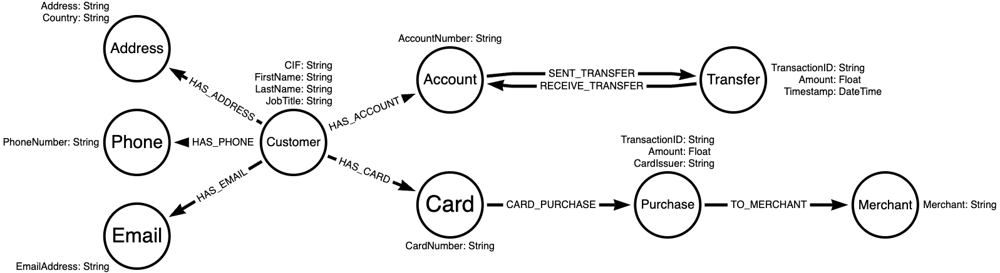

# Task 1: Strategic Dataset Overview

## Banking Network & Fraud Analysis

### 1. Executive Summary

This project transforms a standard relational banking dataset (Customers, Accounts, Transactions) into a **high-fidelity Knowledge Graph**. By moving beyond flat tables, we unlock the ability to detect complex, non-linear patterns such as **Circular Money Laundering**, **Synthetic Identity Clusters**, and **Community-based Fraud Rings**.

The graph-native approach allows for multi-hop relationship traversal that is computationally impossible or inefficient in traditional SQL environments.

---

### 2. Key Entities (Nodes)

To maximize analytical value, the model promotes key attributes to first-class entities:

* **Identity Nodes:** * **Customer:** Individual bank clients (CIF, Age, Job Title).
  * **Address / Email / Phone:** Discrete contact points used to identify shared-identity clusters.
* **Financial Nodes:**
  * **Account:** The primary repository for funds.
  * **Card:** The payment instrument used for retail spending.
* **Activity Nodes:**
  * **Transfer:** Peer-to-peer fund movements between accounts.
  * **Purchase:** Retail spending events at point-of-sale.
  * **Merchant:** The commercial destination for purchases.

---

### 3. Core Relationships (Edges)

The power of this model lies in the directional flow of value and identity links:

* **Ownership & Usage:** `(Customer)-[:HAS_ACCOUNT]->(Account)` and `(Customer)-[:HAS_CARD]->(Card)`.
* **The Flow of Value:** `(Account)-[:SENT_TRANSFER]->(Transfer)-[:RECEIVE_TRANSFER]->(Account)`. This structure allows for precise tracing of fund origins and destinations.
* **Retail Behavior:** `(Card)-[:CARD_PURCHASE]->(Purchase)-[:TO_MERCHANT]->(Merchant)`.
* **Identity Proximity:** `(Customer)-[:HAS_ADDRESS]->(Address)`.

---

### 4. Potential Analytical Use Cases

#### A. Anti-Money Laundering (AML)

* **Circular Transfer Detection:** Identifying funds that leave an account and return to it via multiple intermediate accounts to obscure the source of wealth.
* **Smurfing Identification:** Detecting patterns of many small transfers to a single destination to bypass regulatory reporting thresholds.

#### B. Identity & First-Party Fraud

* **Synthetic Identity Rings:** Using **Shared Contact Analysis** to find multiple Customers sharing a single physical address or phone number—a hallmark of credit mule operations.

#### C. Customer 360 & Marketing

* **Community Detection (Louvain):** Segmenting customers based on their transaction clusters and merchant loyalty rather than just age or demographics.
* **Influence Mapping (PageRank):** Identifying "Hub Accounts" that act as the primary distribution points for large volumes of capital.

### 5. Graph Data Model Visualization
Below is the logical data model designed using Arrows.app, illustrating the transition from a siloed relational structure to a connected banking network.

