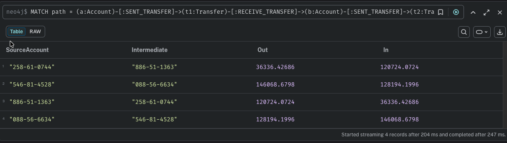
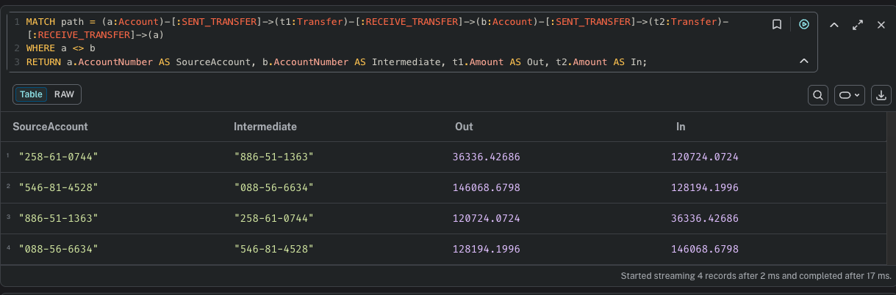
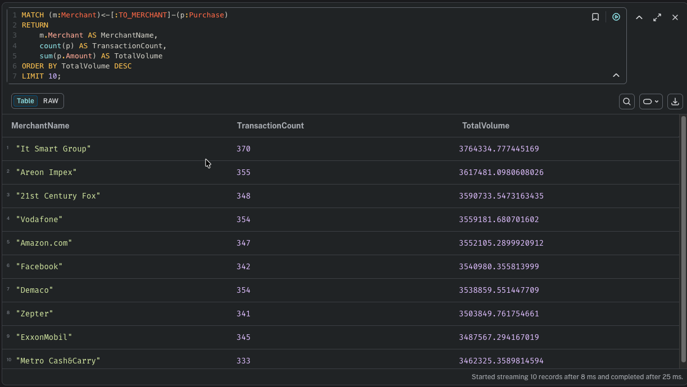
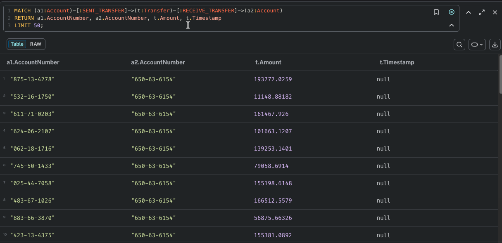

Analytical Queries & Insights (Task 3)
These queries demonstrate the graph's ability to extract actionable intelligence from connected data.

### A. Money Laundering (Circular Transfers)

Identifies "loops" where money returns to the source account after passing through one or more intermediate accounts to obscure the trail.


```cypher
MATCH path = (a:Account)-[:SENT_TRANSFER]->(t1:Transfer)-[:RECEIVE_TRANSFER]->(b:Account)-[:SENT_TRANSFER]->(t2:Transfer)-[:RECEIVE_TRANSFER]->(a)
WHERE a <> b
RETURN a.AccountNumber AS SourceAccount, b.AccountNumber AS Intermediate, t1.Amount AS Out, t2.Amount AS In;
```



### B. Social Engineering / Mule Detection (High Velocity)

Identifies accounts that receive a high volume of transfers from multiple unique sources within a short window, suggesting a "money mule" collection point.

Detects multiple distinct customers sharing the same physical address or phone—a primary indicator of synthetic identity "fraud factories."

```cypher
MATCH (source:Account)-[:SENT_TRANSFER]->(t:Transfer)-[:RECEIVE_TRANSFER]->(target:Account)
WITH target, count(DISTINCT source) AS uniqueSenders, sum(t.Amount) AS totalReceived
WHERE uniqueSenders > 3
RETURN target.AccountNumber AS MuleCandidate, uniqueSenders, totalReceived
ORDER BY uniqueSenders DESC;
```



### C. High-Risk Merchant Identification

Business Value: Identifies merchants with unusually high transaction volumes or specific patterns of card spending, helping the bank flag potential compromised Point-of-Sale (POS) locations.

```cypher
MATCH (m:Merchant)<-[:TO_MERCHANT]-(p:Purchase)
RETURN 
    m.Merchant AS MerchantName, 
    count(p) AS TransactionCount, 
    sum(p.Amount) AS TotalVolume
ORDER BY TotalVolume DESC 
LIMIT 10;
```




### D. Direct Account-to-Account Pathfinding

Business Value: Visualizes the direct relationships between accounts, ignoring the "Transfer" node middleman to provide a cleaner view for investigators.

```cypher
MATCH (a1:Account)-[:SENT_TRANSFER]->(t:Transfer)-[:RECEIVE_TRANSFER]->(a2:Account)
RETURN a1.AccountNumber, a2.AccountNumber, t.Amount, t.Timestamp
LIMIT 50;
```

